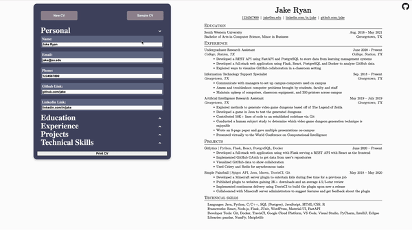

<h1 align="center">Welcome to  👋</h1>
<p>
  <a href="https://twitter.com/arysaikyn" target="_blank">
    
  </a>
</p>

> A simple CV Maker

### ✨ [Demo](cv-maker-delta-ten.vercel.app)

## Install

```sh
npm install
```

## Author

👤 **Arys Aikyn**

* Twitter: [@arysaikyn](https://twitter.com/arysaikyn)
* Github: [@arysaikyn](https://github.com/arysaikyn)
* LinkedIn: [@arysaikyn](https://linkedin.com/in/arysaikyn)

## Show your support

Give a ⭐️ if this project helped you!

# 📄 CV-Maker

[](https://github.com/arysaikyno/CV-Maker#readme)

> A Resume Maker built using React.js
> Developed for The Odin Project's
> [curriculum](https://www.theodinproject.com/lessons/node-path-react-new-cv-application).

## ✨ Demo
[](https://arysaikyn.github.io/CV-Maker)

## 📜 Docs

### Install

```sh
npm install
```
Installs dependencies.

### Start

```sh
npm run start
```
Starts the development server.

### Watch

```sh
npm run watch
```
Runs the test runner in watch mode.

### Build

```sh
npm run build
```

Builds the app for production to the `dist` directory.

## 📖 Lessons Learned

- React Fundamentals
- Creating a react app with Vite
- Class components and lifecycle methods
- Function components and Hooks
- Migrating from class components to function components
- Controlling inputs and rendering lists in react
- Managing state in react
- Deploying a site with a PaaS like Vercel.

## Author

👤 **Arys Aikyn**

* Github: [@arysaikyn](https://github.com/arysaikyn)
